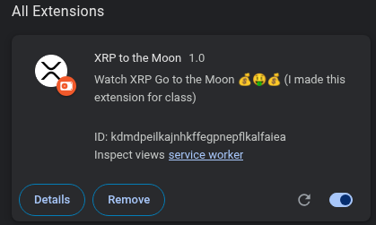
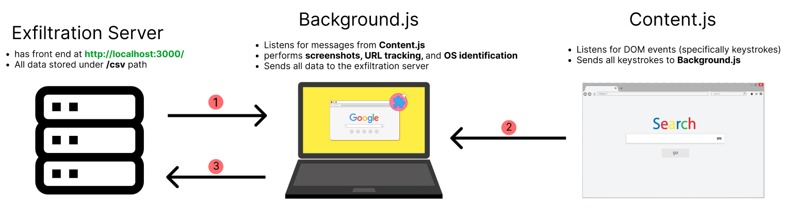

# XRP to the Moon - Privacy Destroying Extension 

<p align="center">
  
</p>

## About the project
I wanted to make this project as realistic as possible, so I created a Trojan Horse. The user thinks they are installing an extension that 
lets them see the live price of XRP, but in reality my extension is doing much more than that 😈.  

# Installation Guide

## 1. Start the Exfiltration Server

1. **Setting up exfiltration server:**

```bash
  sudo apt update
  sudo apt install nodejs npm -y   # Install Node.js and npm
  cd server                        # Navigate to the server directory
  node server.js                   # Start the server
```
2. **Installing the extension:**
   1. Go to `chrome://extensions/` in your Chrome browser.
   2. Turn on the **Developer Mode** toggle in the top-right corner.
   3. Click on **Load unpacked**.
   4. Load the `PrivacyDestroying Extension (XRP)` folder and enable the extension.
   5. If everything works correctly, the extension should look like this:
   
      
3. **Wait for the data to load!**
   
   In chrome go to `http://localhost:3000/` and wait for the data to load! All the exfiltrated data can also be viewed in the `/csv` folder.

## Features
- **URL Tracking**  
  - The `background.js` file first iterates through all open tabs to record their URLs.
  - It utilizes `chrome.webRequest.onBeforeRequest.addListener()` to capture the original URL as entered by the user, before the browser applies any upgrades or redirects.  
  - It also uses `chrome.tabs.onUpdated.addListener()` to listen for updates to tab URLs.  

- **Keylogger**  
  - The `content.js` file uses `document.addEventListener("keydown")` to track keystrokes.  
  - Each keystroke is then transmitted to the `background.js` script.  

- **Credential Harvester**  
  - The `content.js` file uses `document.addEventListener("submit")` to detect form submission events.  
  - It parses the form’s input fields and extracts credentials in plaintext.  
  - Once extracted, the credentials are sent to `background.js`.  

- **Screenshots**  
  - The `background.js` script uses `chrome.tabs.captureVisibleTab()` to capture a screenshot of the active tab.  
  - The image is then encoded as a Base64 string and sent to the exfiltration server.


## Running on Test Environment:
```bash
  python3 run_test1.py PrivacyDestroyingTextension http://localhost:3000/for-testing
```
<span style="color:red; font-size:25px;">Testing on Selenium did not work locally, but MANUALLY does! Had issue capturing http:// requests</span>


## How It Works:
- My extension is mainly composed of 2 scripts: **background.js and content.js**
- **background.js**: this scripts runs in the background when the extension is active. It is primarily responsible for collecting data from the content.js script and sending it to the exfiltration server. By itself, it is able to collect the active URLs, take screenshots, and collect OS information
- **content.js**: Only content scripts can directly access and listen for DOM events such as keydown, so it is used to record the user's keystrokes and harvest their credentials. All data that the content.js receives is sent to the background.js file.


